# School_District_Analysis

## Overview

A chief data sciencetist for a city school district who's responsible for analyzing information from a variety of sources and a variety of formats request our help .
She's tasked with preparing  all standarized test data for analysis, reporting and presentation to provide insights about performance trends and patterns. These insights are used to inform discussions and strategic decisions at the school and district level.  
We'll be helping Maria analyize data on student funding and students standarized test scores.
The tasks is to aggregate the data and showcase trends in school performance. This analysis will assist the school board and superintendent in making decisiones regarding the school budgets and priorities.

Two datasets were provided, the first one contains information about students and has 39,169 rows and the second one contains information of the schools and only has 15 rows. 
We'll be using pandas library and jupyter notebook to perform this analysis, also we'll use the read_csv method to read the file as a DataFrame.

When we display the students dataframe the names were displayed with errors. 
The student dataset needed to be cleaned because some names had prefixes and suffixes, like *["Dr. ", "Mr. ","Ms. ", "Mrs. ", "Miss ", " MD", " DDS", " DVM", " PhD"]* .   
For this task we use a For loop to iterate through the student's names and replace the prefixes and suffixes with nothing and the DataFrame is ready for analysis.

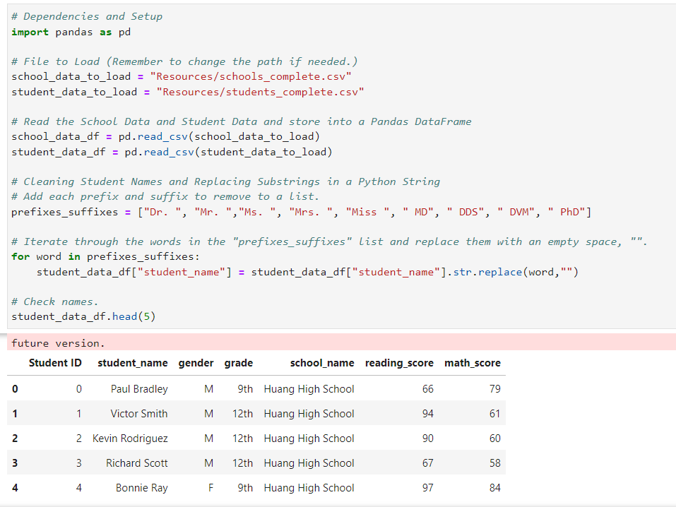

A previous analysis was performed, but we received information from the school board that students from __9th grade__ at the __Thomas High School__ appear to have been altered, therefore, we'll run the analysis again not considering that part of the information.

We will replace the reading and math scores for 9th grade at Thomas High School with 'NaN' values, this task was performed using *.loc* property from pandas library and the *.nan* method from the numpy library.

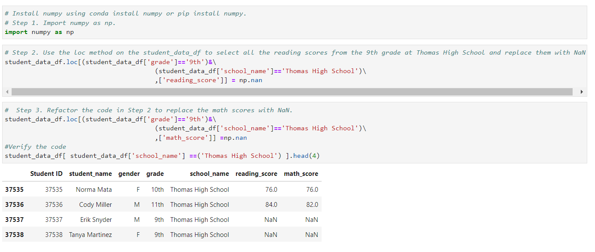

To check if only 9th graders from Thomas High School were modified a comparisson was made as follows:

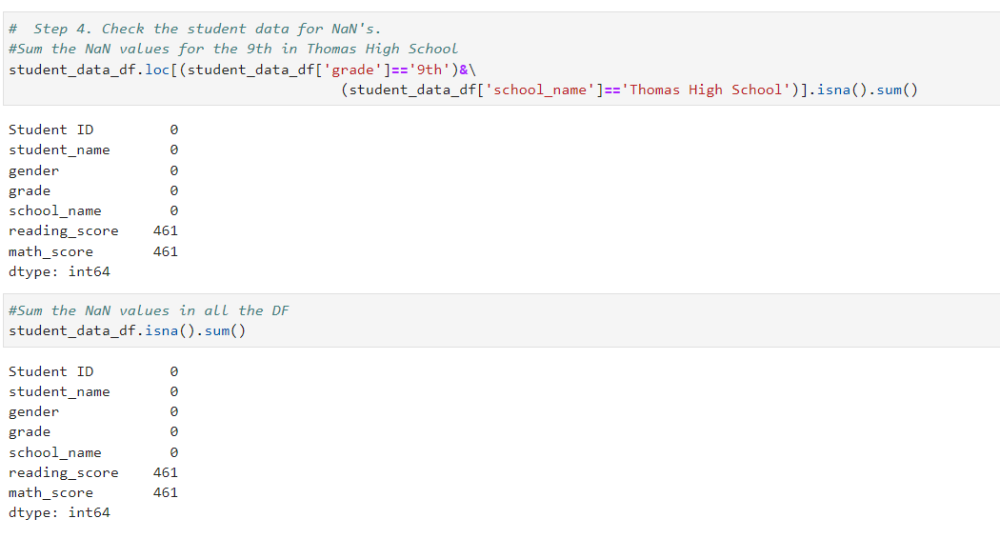

## Results

As mentioned earlier, a previous analysis was performed and since some information was modified we'll analyze how this modifications affected the results obtained.

* __How is the district summary affected?__ 
    As we can see the district summary was barely affected, since the 461 students represent approximately 1% of the total of students from all high schools. 

    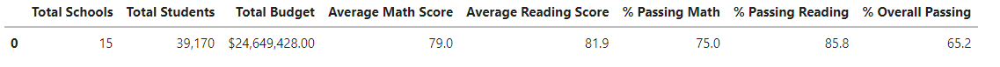

    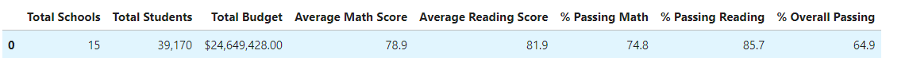

* __How is the school summary affected?__ 
    When the math and reading scores from 9th graders of Thomas High School were put as NaN the averages from math and reading barely changed, this could be because   these student's grades were closed to the mean (~83). 
    On the other hand, a drastic change in percentages happens, this means that most of the 9th graders passed both subjects and when calculations were performed not considering them, the numbers dropped. 

    

    

* __How does replacing the ninth graders’ math and reading scores affect Thomas High School’s performance relative to the other schools?__ 
    When the calculations were performed again but not considering the quantity of 9th grade students from Thomas High School neither their scores, the school district summary showed numbers close to the original summary where we consider the quantity of 9th grade students from Thomas High School.

        

* __How does replacing the ninth-grade scores affect the following:__  

    - __Math and reading scores by grade__ 
    Regarding the performance in math and reading by grade, we notice that for 9th grade there's no information and for the rest of the grades the scores remain the       same. The images from below shows on the left the original dataframe and in the right is the dataframe not considering the 9th grade students from Thomas High          School.
    With the new dataframe an evaluation in performance could not be made since we don't have enough information and it could lead to wrong decisions regarding priorities and affect other schools budgets.

    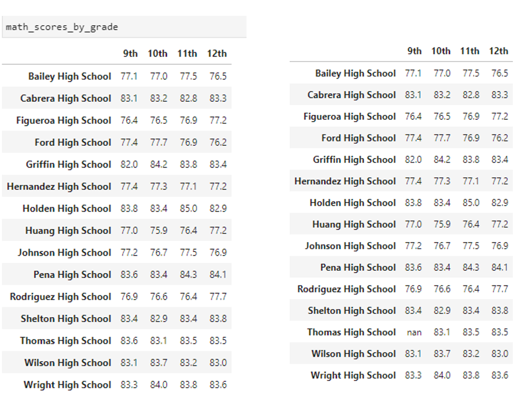
    > **Math Scores**

    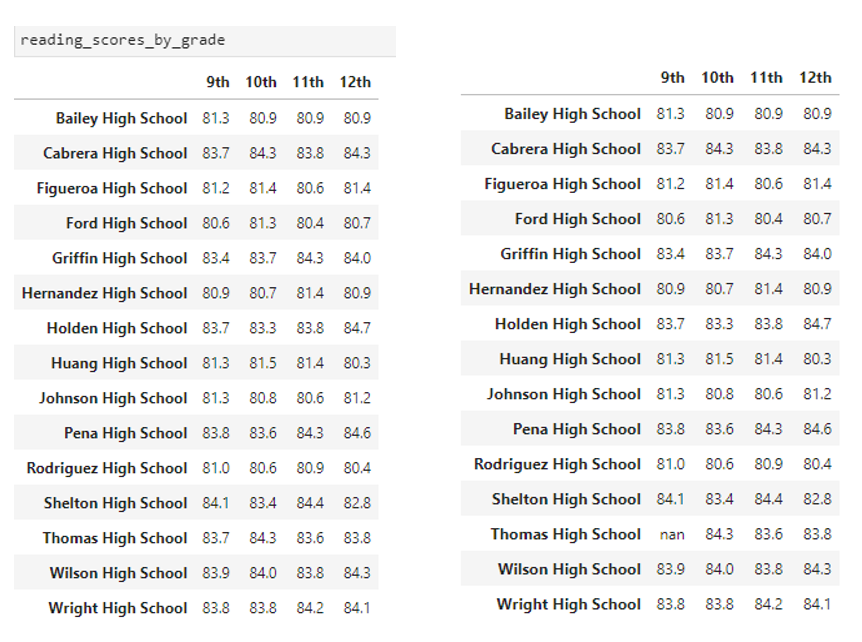
    > **Reading Scores**

    - __Scores by school spending__ 
    The amounts were affected by decimals but when rounding the changes are not significant since they don't affect the result. 
    We can check this in the images below.

    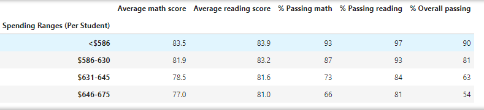
    > **Score by spending considering 9th THS**

    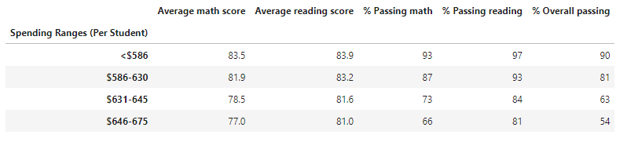
    > **Score by spending not considering 9th THS**
    

    - __Scores by school size__ 
    This is the same case as the scores by school spending, there's no changes.

    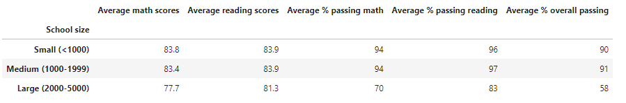
    > **Score by size considering 9th THS**

    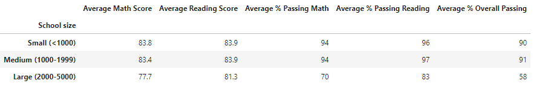
    > **Score by size not considering 9th THS**
    

    - __Scores by school type__ 
    There's no changes in scores by school type.

    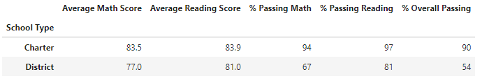 
    > **Score by type considering 9th THS**

     
    > **Score by type not considering 9th THS**

## Summary

The changes for math and reading scores by grade, scores by school spending, scores by school size and scores by school type are not significant when comparing with the original information. 
But with this information a decision regarding budget or priorities for schools wouldn't be accurate because there's still missing information of the real performance from the 9th grade students from THS.  
The real information is needed to make decisions.

